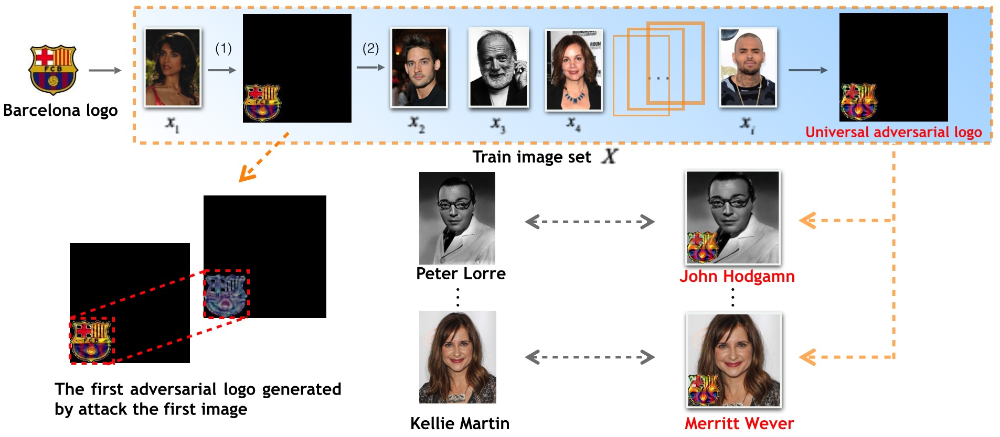
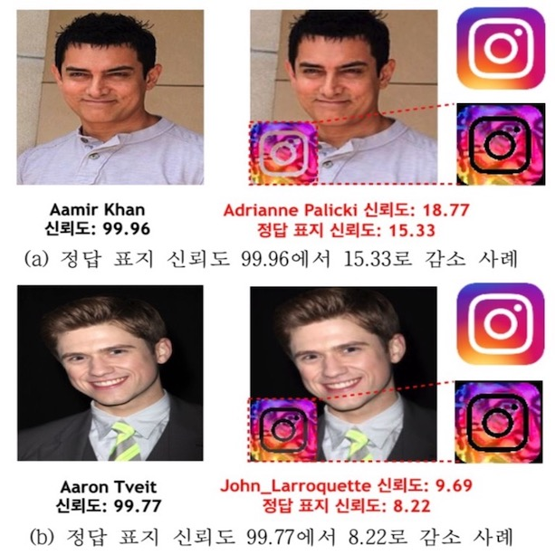

## Introduction
We propose a adversarial attack method that created the adversarial case using a stamp and attaches it to the image to fool the deep neural network. And we have further generated a universal adversarial stamp that can attack most image dataset.

## Preparation
* **Attacked model:** VGG-Face Net ([Introduction](https://www.robots.ox.ac.uk/~vgg/software/vgg_face/))
* **Dataset:** VGG Face Dataset(We only use the part of the VGG Face dataset in this experiment.If you want to download, please click [here](https://1drv.ms/u/s!ArO-oAeuF5tOcYey7E4l571LLcI?e=iUo7Tn))
* **Logo:** Barcelona logo，Instagram logo
* **Algorithm:** Deepfool+Universal adversarial perturbations(stamp)([References1](https://www.cv-foundation.org/openaccess/content_cvpr_2016/papers/Moosavi-Dezfooli_DeepFool_A_Simple_CVPR_2016_paper.pdf)) ([References2](http://openaccess.thecvf.com/content_cvpr_2017/papers/Moosavi-Dezfooli_Universal_Adversarial_Perturbations_CVPR_2017_paper.pdf))
* **Pytorch** ([Instructions](https://pytorch.org/get-started/locally/))
* **NumPy** ([Instructions](https://scipy.org/install.html))
* **Pandas** ([Instructions](https://scipy.org/install.html))

## Usage
1.`evalVGG.py`：Selecting the image that can be classified correctly from the downloaded data set and generate the vgg_selected.csv.

2.`evalDWMF.py`：First, selecting images that can be correctly classified by adding the normal stamps(no perturbation) in the left-up,right-up,left-down,right-down and generate the csv file:

```shell
    # UAP(config[args.config]) 
    # test1(config[args.config])
    # test2(config[args.config]) 
    selectIMG()  
```
Then generate the universal adversarial stamp:

```shell
    UAP(config[args.config]) 
    # test1(config[args.config])
    # test2(config[args.config]) 
    # selectIMG()  
```

* `test1`: In the process of generating the universal adversarial stamp, we saved the universal stamp perturbation in pkl format. Then add the perturbation in pkl format to the original images+stamp and test.

* `test2`: We also saved the universal stamp perturbation in png format. Then add the perturbation in png format to the original images+logo and test.


3.`config.yaml`：Modify the key parameters in the experiments.

* `sp`: the location about universal adversarial stamp(left-up,right-up,left-down,right-down)

* `train`: Selecting the training image data used when generating the stamp.

* `test`: Selecting the image data for attack.

* `threshold`: When the stamp successfully attacked `threshold` images, the perturbation generation was stopped.

* `maxiter`: The maximum number of allowed loops

* `v_path`: The path of saving the final universal perturbation

* `maskzone_path`: The path of saving the final universal perturbation+stamp

* `v_path2`: Save the perturbation by attack success rate(10%,20%,30%,40%,50%...)

* `maskzone_path2`: Save the perturbation+stamp by attack success rate(10%,20%,30%,40%,50%...)

* `logfile2`: The path of saving the log in test1.

* `logfile3`: The path of saving the log in test2.

* `rtot_pkl`: Save the final perterbation in pkl format.

4.Please put the downloaded model weights into the `model` folder([Download](https://1drv.ms/u/s!ArO-oAeuF5tOcYey7E4l571LLcI?e=iUo7Tn)). And according to the path to save the result in `config.yaml`, create the corresponding folder.

5.Generation of Universal Adversarial Image Stamp:


## Example

